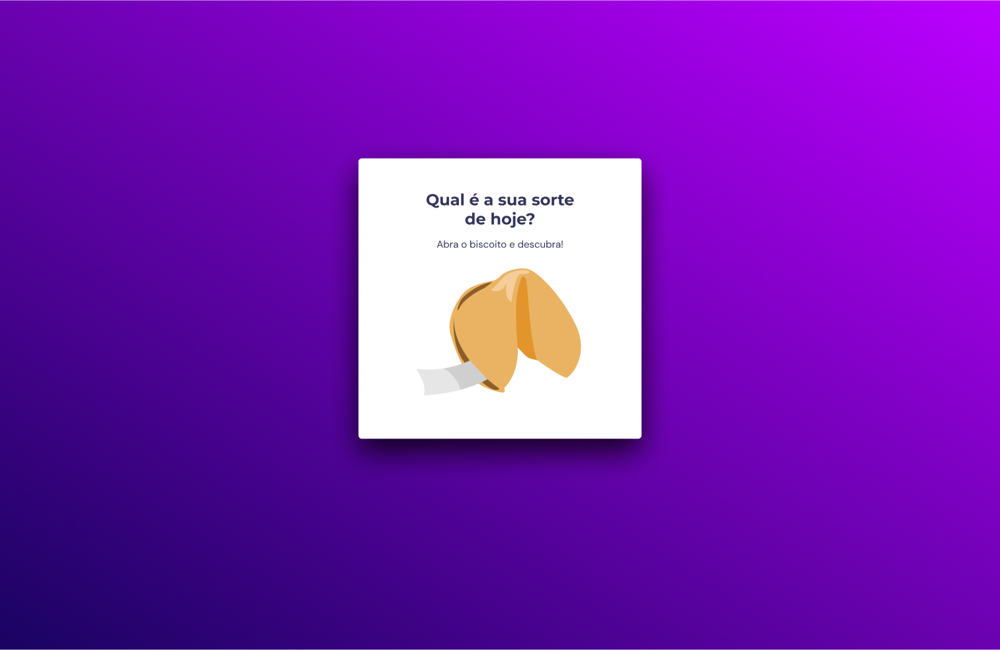
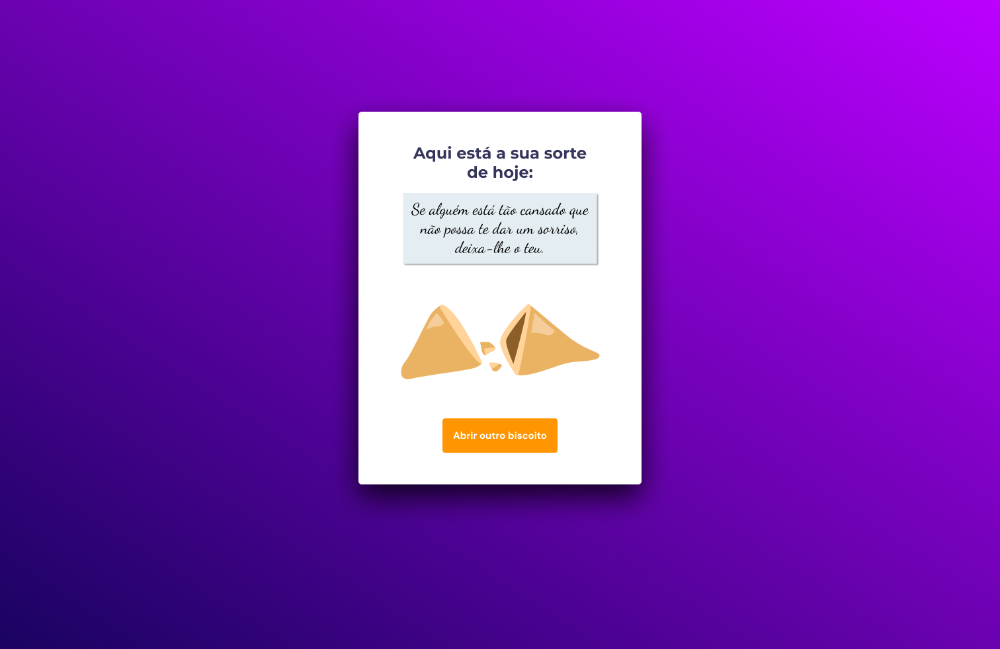

# Biscoito da Sorte

---

Desafio do curso **Explorer** da **_Rocketseat_** que consiste em fazer um programa em que ao clicar no "biscoito da sorte", aparece a mensagem ("sorte do dia"), onde também é possível abrir quantas mensagens quiser. O biscoito da sorte e a mensagem contam com animação feita em CSS. As mensagens vêm diferentes de forma aleatória.

## Features:

- Estrutura de dados
- Animações com CSS
- Funções e Funções Callbacks
- Manipulação da DOM
- Biblioteca JS Math()
- Arrays

## Resources:
- [Mensagens do biscoito da sorte](https://www.mulherportuguesa.com/pessoa/desenvolvimento-pessoal-pessoas/frases-para-biscoitos-sorte/)
- [Fonts](https://fonts.google.com/)

---
Made with 🩷 by [Annd](https://github.com/anndcodes/)
